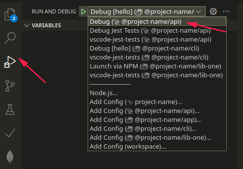

# Monorepo API Restfull `@project-name/api`

| References | Description |
| -----------|----- |
| [tsoa](https://tsoa-community.github.io/docs/getting-started.html) | Restful Framework and Swagger generator |

## Project stricture 

* 📁 [.vscode/](./api/.vscode)
  * 📃 [launch.json](./api/.vscode/launch.json)
* 📁 [docs/](./api/docs)
  * 📃 [vscode-debug.png](./api/docs/vscode-debug.png)
* 📁 [src/](./api/src)
  * 📁 [.config/](./api/src/.config)
    * 📃 [routes.ts](./api/src/.config/routes.ts)
  * 📁 [health/](./api/src/health)
    * 📃 [health.controller.ts](./api/src/health/health.controller.ts)
    * 📃 [interfaces.ts](./api/src/health/interfaces.ts)
  * 📁 [hello/](./api/src/hello)
    * 📃 [hello.controller.ts](./api/src/hello/hello.controller.ts)
    * 📃 [interfaces.ts](./api/src/hello/interfaces.ts)
  * 📁 [user/](./api/src/user)
    * 📃 [interfaces.ts](./api/src/user/interfaces.ts)
    * 📃 [user.controller.ts](./api/src/user/user.controller.ts)
    * 📃 [user.service.ts](./api/src/user/user.service.ts)
  * 📃 [app.ts](./api/src/app.ts)
  * 📃 [server.ts](./api/src/server.ts)
* 📃 [.eslintrc.js](./api/.eslintrc.js)
* 📃 [.gitignore](./api/.gitignore)
* 📃 [.prettierrc](./api/.prettierrc)
* 📃 [README.md](./api/README.md)
* 📃 [jest.config.js](./api/jest.config.js)
* 📃 [nodemon.json](./api/nodemon.json)
* 📃 [package-lock.json](./api/package-lock.json)
* 📃 [package.json](./api/package.json)
* 📃 [swagger.json](./api/swagger.json)
* 📃 [tsconfig.json](./api/tsconfig.json)
* 📃 [tsoa.json](./api/tsoa.json)
* 📃 [yarn-error.log](./api/yarn-error.log)
* 📃 [yarn.lock](./api/yarn.lock)

## Debbuging with VSCode
